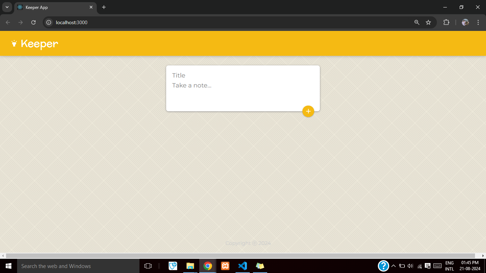
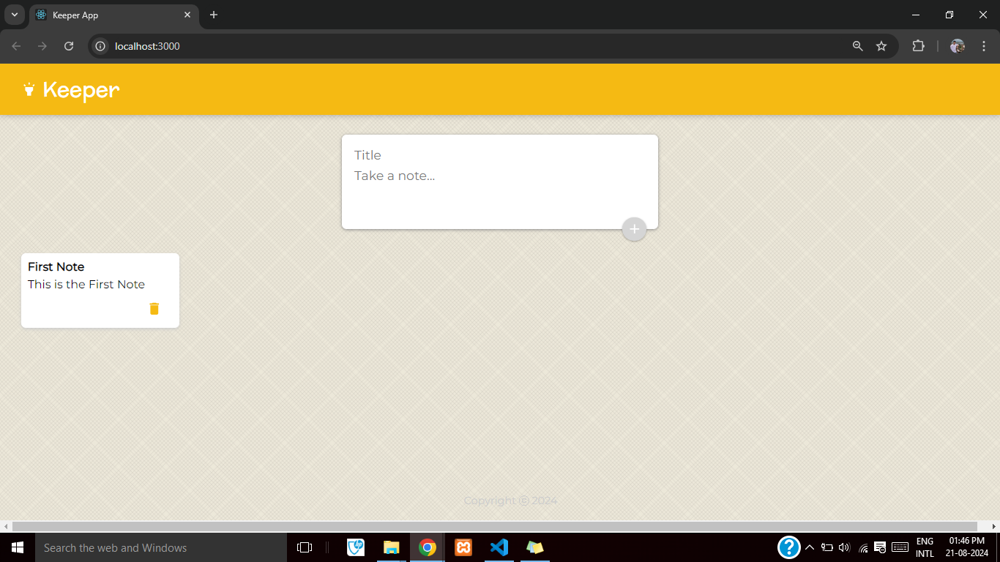
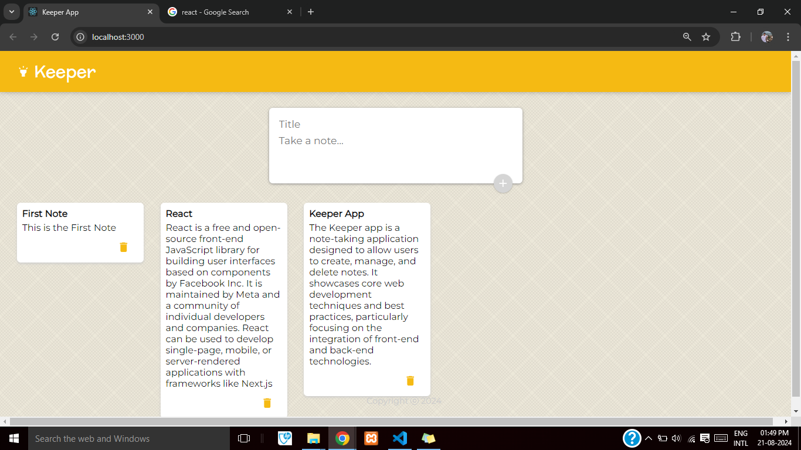
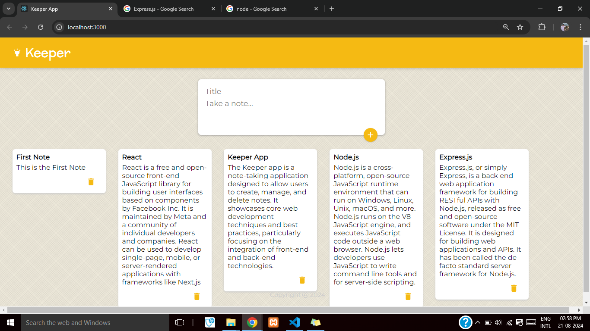
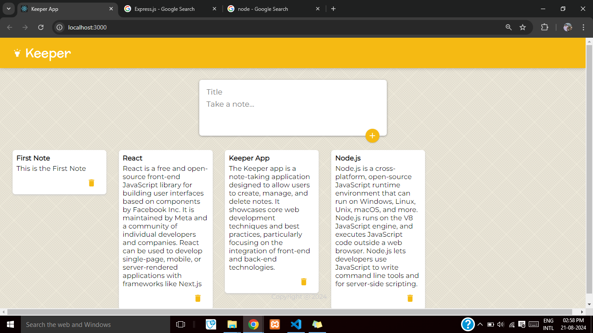

# Udemy - Keeper App Project 

This is a solution to the [Keeper App Project](https://www.udemy.com/course/the-complete-web-development-bootcamp/).

## Table of contents

- [Overview](#overview)
  - [The challenge](#the-challenge)
  - [Screenshots](#screenshots)
  - [Links](#links)
- [My process](#my-process)
  - [Built with](#built-with)
  - [Useful resources](#useful-resources)
- [Author](#author)

## Overview

### The challenge

- Create a Keeper App using React that is a similar clone of Google Keep.

### Screenshots

### Links

- Solution URL: [https://github.com/fotinh0/keeper-app](https://github.com/fotinh0/keeper-app)
- Live Site URL: [https://keeper-app-fc.netlify.app/](https://keeper-app-fc.netlify.app/)   

## My Process
### Built with

- React.js
- HTML / CSS / ES6

### Useful resources

- [Material UI](https://mui.com/)

- [reactjs.org](https://reactjs.org/docs/getting-started.html)

## Author

- GitHub - Yash Joshi (https://github.com/yashgjoshi20)
- Frontend Mentor - Yash Joshi (https://www.frontendmentor.io/profile/yashgjoshi20)
